# Implementation of Histogram Equalization and Edge Detection Using MATLAB

An image processing project implemented in MATLAB, covering two main topics:

1. **Histogram Equalization** (custom implementation vs. MATLAB built-in `histeq`)
2. **Edge Detection** (Laplacian, Sobel, Canny)

## File Structure

```
.
├── hw3.m                  # Main script: color histogram equalization + edge detection
├── My_histeq.m            # Custom histogram equalization function
├── Compare_histeq.m       # Comparison: custom vs. built-in histeq
├── image.png              # Input image
├── results/                    # Output results
│   ├── histogram_result/       # Histogram equalization results
│   │   ├── original_histogram.png     # Original luminance histogram
│   │   ├── equalized_histogram.png    # Equalized luminance histogram
│   │   ├── processed_grayscale.png    # Equalized grayscale (luminance) image
│   │   ├── processed_color.png        # Equalized color image
│   │   ├── result_1.png               # Custom vs. histeq comparison
│   │   ├── result_2.png               # Luminance mapping curve
│   │   ├── result_3.png               # Cumulative distribution function (CDF)
│   │   └── result_4.png               # Color equalization result comparison
│   └── detected_edges_result/  # Edge detection results
│       ├── laplacian_4n.png
│       ├── laplacian_4n_binarized.png
│       ├── laplacian_8n.png
│       ├── laplacian_8n_binarized.png
│       ├── sobel.png
│       ├── sobel_binarized.png
│       └── canny.png
└── README.md
```

## Features

### 1. Histogram Equalization (`My_histeq.m`)

A custom implementation without using `histeq` or `imhist`. The process is:

1. Compute the luminance histogram for intensity values 0–255
2. Calculate the probability density function (PDF) and cumulative distribution function (CDF)
3. Build a mapping table `T` from the CDF
4. Apply the mapping table to produce the equalized image

`Compare_histeq.m` compares the custom implementation against the built-in `histeq` (default 64 gray levels / specified 256 gray levels), and plots the mapping curves and CDF.

### 2. Edge Detection (`hw3.m`)

- **Color Histogram Equalization**: Converts RGB → HSV, equalizes only the V (luminance) channel, then converts back to RGB to avoid color distortion.
- **Edge Detection Methods**:
  - **Laplacian**: 4-neighbor and 8-neighbor kernels, each with raw and normalized+binarized results
  - **Sobel**: Horizontal/vertical gradient magnitude, with normalized+binarized results
  - **Canny**: Applied separately to R, G, B channels and merged

## How to Run

Open this folder as the working directory in MATLAB and execute:

```matlab
hw3              % Histogram equalization + edge detection
Compare_histeq   % Custom vs. built-in histeq comparison
```

> Requires **Image Processing Toolbox**.

## Results Preview

### Histogram Equalization

| Comparison | Mapping Curve | CDF |
| --- | --- | --- |
| 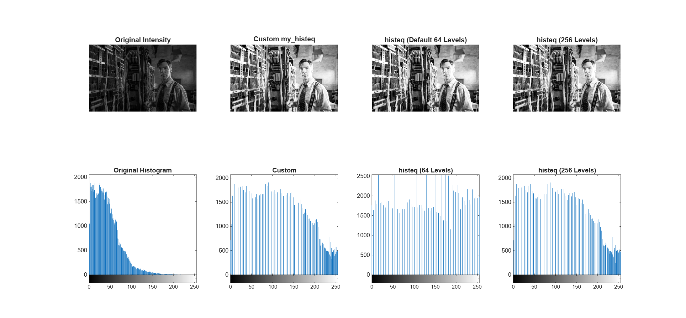 | 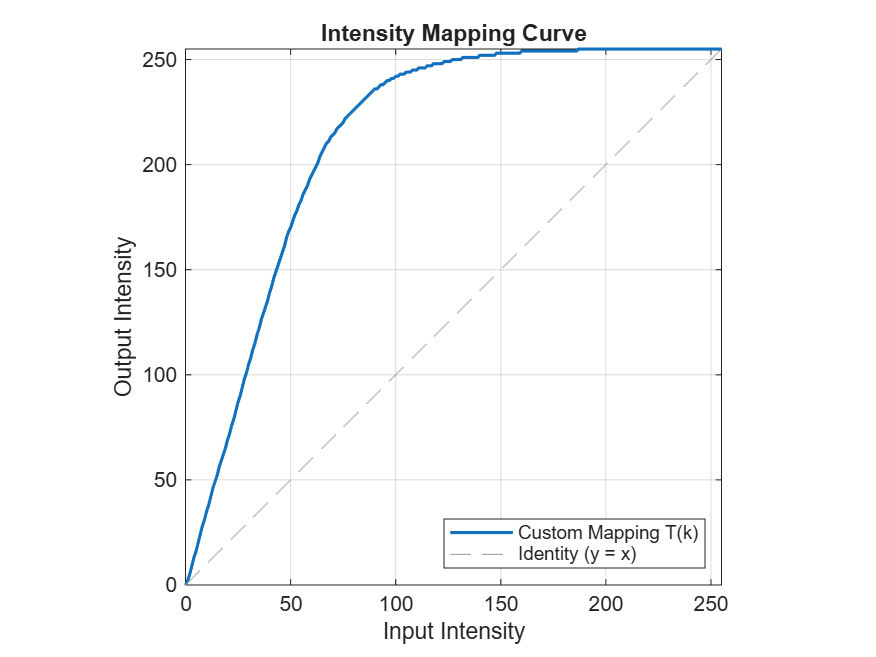 | 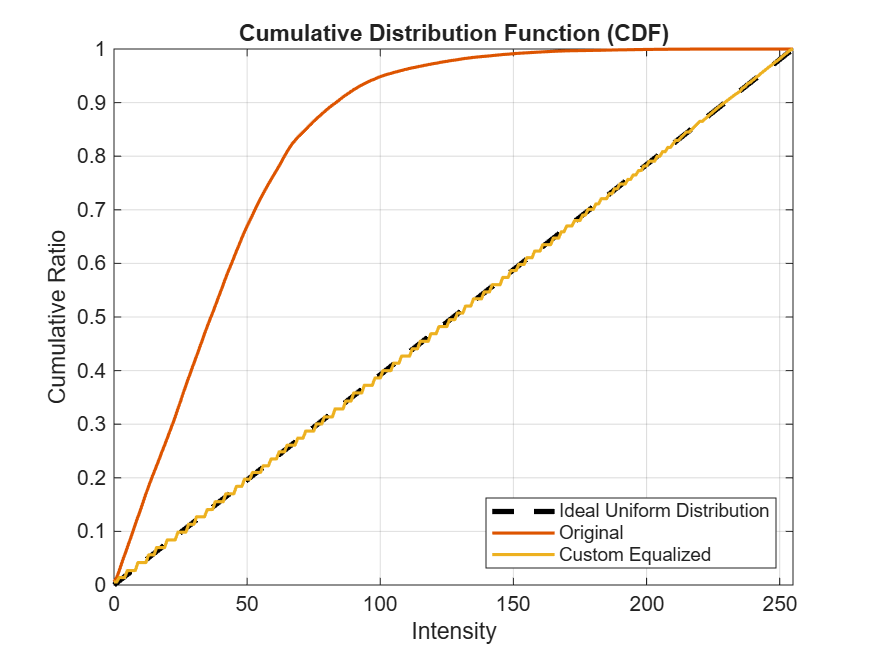 |

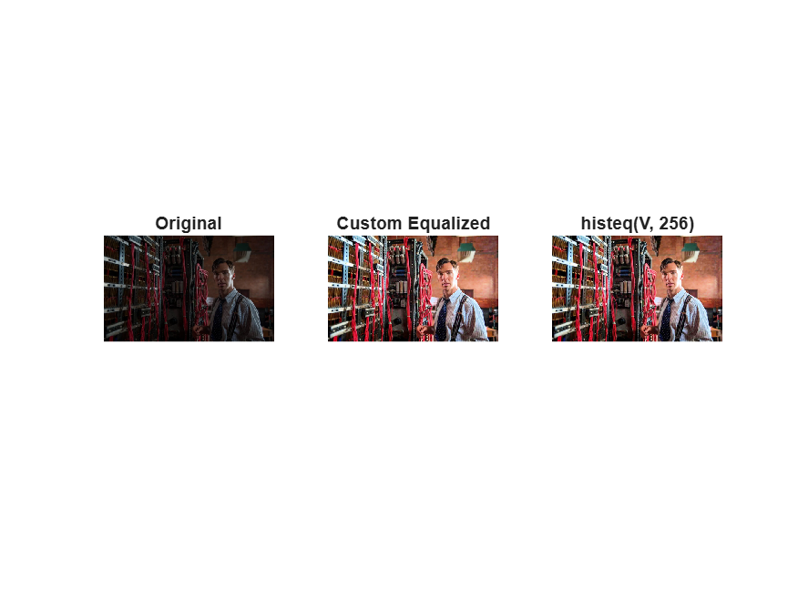

### Edge Detection

| Laplacian 4n | Laplacian 8n | Sobel | Canny |
| --- | --- | --- | --- |
| 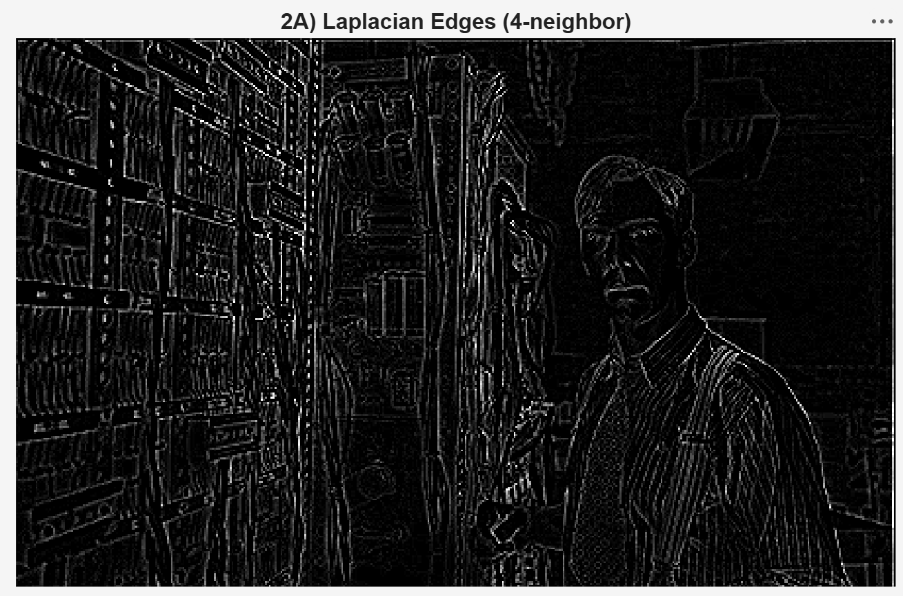 | 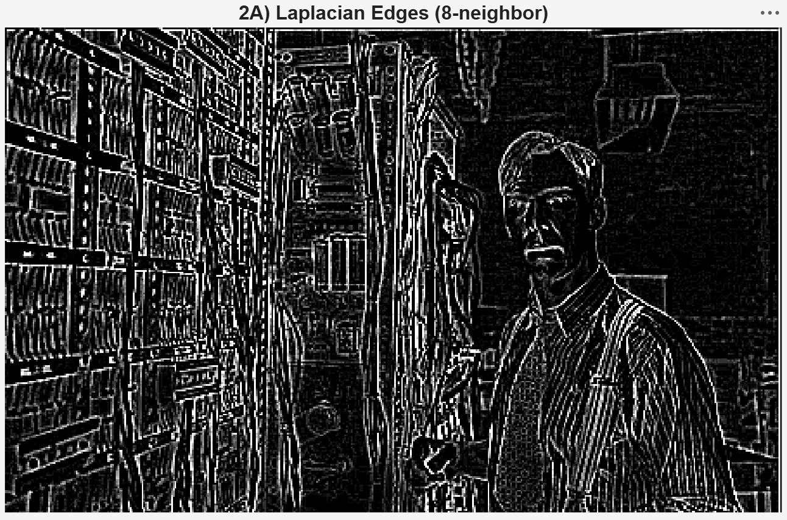 | 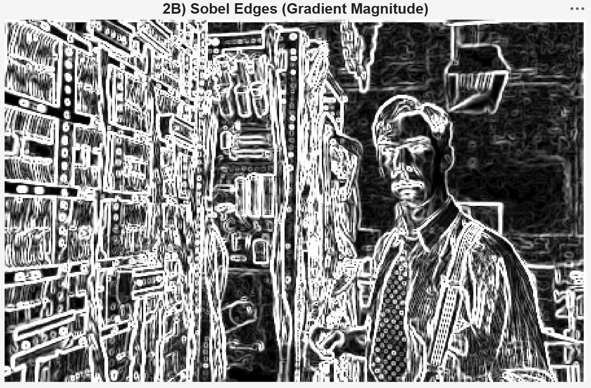 | 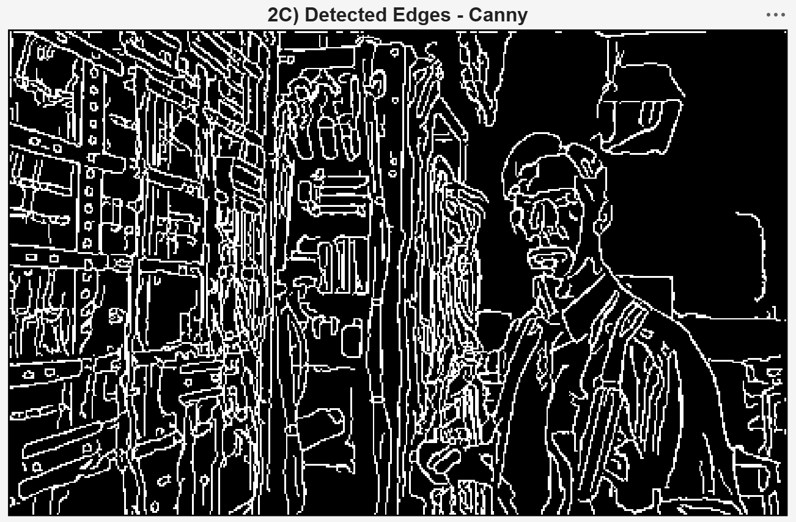 |

| Laplacian 4n Binarized | Laplacian 8n Binarized | Sobel Binarized |
| --- | --- | --- |
| 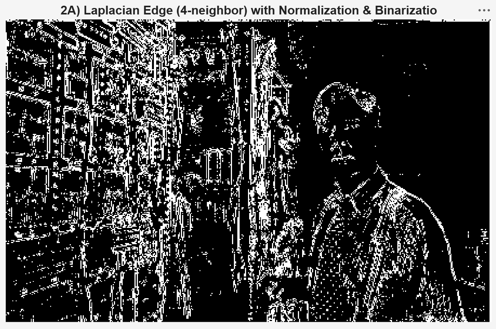 | 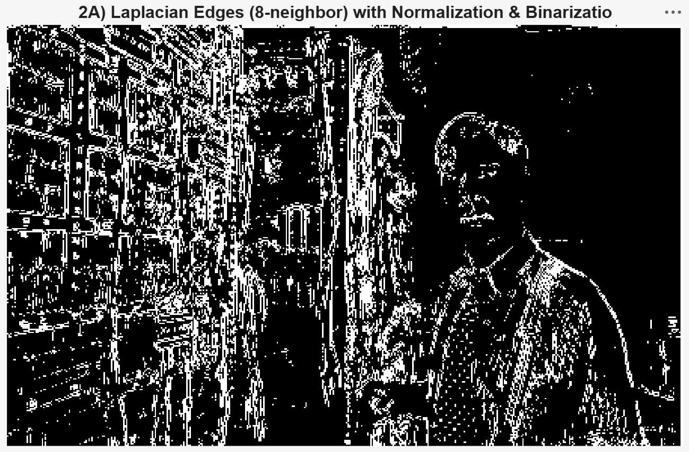 | 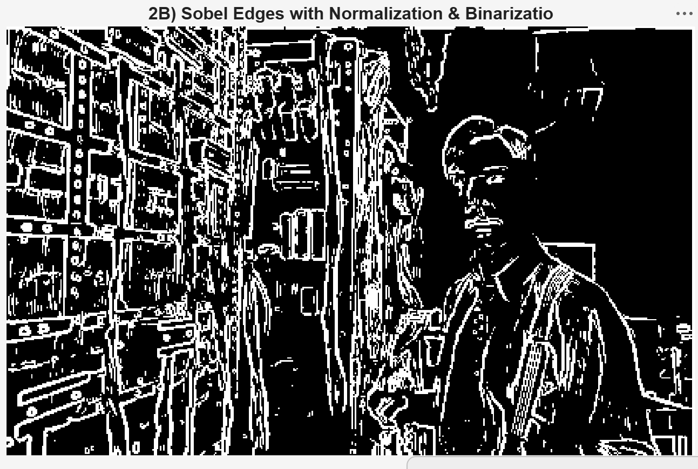 |

## Environment

- MATLAB (with Image Processing Toolbox)
